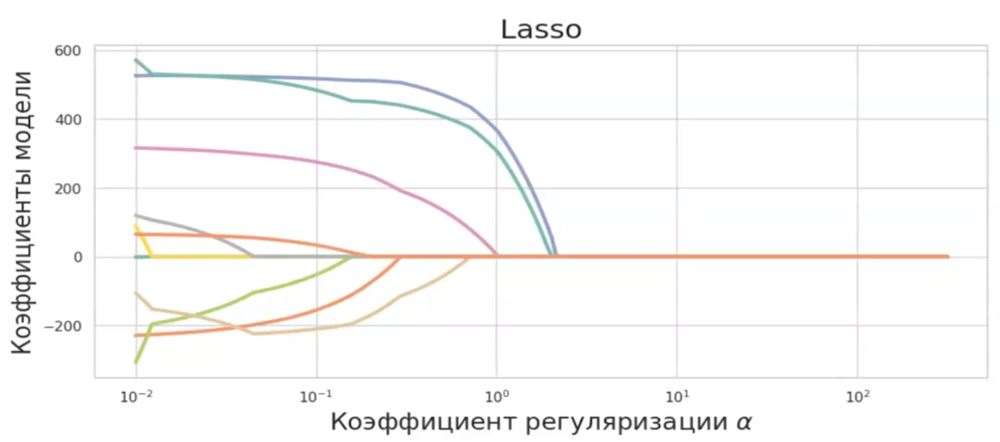
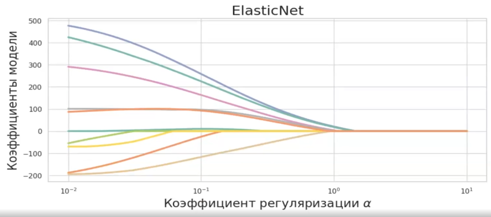
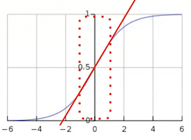
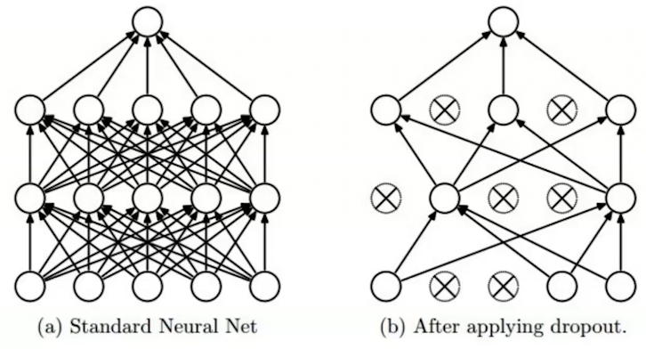

<!-- markdownlint-disable MD025, MD001, MD024 -->

# Lecture 1 - Intro

## Missing Data

1. **Missing Completely at Random** - probability of a missing value is independent of both the observed and unobserved data.

    - Drop rows
    - Imputation:

        - Mean/Median/Mode
        - Model Prediction based on observed data: OLS, K-NN, ...

2. **Missing at Random** - probability of a missing value depends only on observed data.

    - -//-

3. **Missing Not at Random** - probability of a missing value depends on the missing data itself.

    - "Missing or not" variable:

        - New binary for continuous
        - New class for categorical

    - Cannot be dropped!!!

# Lecture 2 - OLS

## [Bias-Variance Decomposition](https://en.wikipedia.org/wiki/Bias%E2%80%93variance_tradeoff)

Decomposition: **bias**, **variance**, **irreducible error** (intrinsic noise in data).

$y = f(X) + \epsilon$

$$
\text{MSE} = \mathbb{E}[(y - \hat{f}(X))^2] = \text{Bias}^2 + \text{Variance} + \sigma^2
$$

- **High Bias**: The model is too simple (e.g., underfitting), leading to systematic errors.

- **High Variance**: The model is too complex (e.g., overfitting), capturing noise instead of patterns.

### For Parameter

$$
\mathbb{E}[(\theta - \hat{\theta}(X))^2] = \text{Bias}^2 + \text{Variance}
$$

$\to$ **classes of efficiency** of bias=b.

## Regularization

### Problem

$$
\hat{\theta}_{OLS} = (X^TX)^{-1} X^T y
$$

Therefore:

$$
\mathbb{V}[\hat{\theta}] = \sigma^2 (X^T X)^{-1}
$$
$$
\mathbb{V}[\hat{y}(x)] = x^T \mathbb{V}[\hat{\theta}] x = \sigma^2 x^T (X^T X)^{-1} x
$$

The more number of regressors $d$ at fixed $N$ $\to$ the closer $X$ to being singular (**multicollinearity**) $\to$ $(X^T X)^{-1}$ closer to $\infin$ $\to$ crazy variance.

---

### Ridge

Before doing so need **standartization** of $X$ and $y$:

$$
z_{new} = \frac{z - \mathbb{E}[z]}{\mathbb{V}[z]}
$$

```py
scaler = StandardScaler()

X_train = scaler.fit_transform(X_train)
X_test = scaler.transform(X_train)
```

Task:

$$L(\theta) = ||y - X\theta||^2 + \lambda ||\theta||^2 \to \min_{\theta \in R^d}$$

$\theta_0$ is not included in $\lambda ||\theta||^2$.

$$
\hat{\theta}_{Ridge} = (X^TX + \lambda \mathit{I})^{-1} X^T y
$$

#### Properties

1. $\lambda$
    - $\lambda = 0$ $\to$ $\hat{\theta}_{Ridge} = \hat{\theta}_{OLS}$
    - $\lambda = \infin$ $\to$ $\hat{\theta}_{Ridge} = 0$ (except for $\theta_0$)

2. Now $\hat{\theta}_{Ridge}$ is **biased**(!):  
    $$
    \mathbb{E}[\hat{\theta}_{Ridge}] = x^T (X^TX + \lambda \mathit{I})^{-1} X^T X \theta
    $$

    Leading to biased prediction:
    $$
    \mathbb{E}[\hat{y}(x)] = x^T (X^TX + \lambda \mathit{I})^{-1} X^T X \theta
    $$

3. But $\hat{\theta}_{Ridge}$ has less variance:
    $$
    \mathbb{V}[\hat{\theta}_{Ridge}] = (X^TX + \lambda \mathit{I})^{-1} X^T X (X^TX + \lambda \mathit{I})^{-1}
    $$

4. For unrelevant $x^d$: $\hat{\theta}_{Ridge}^d \in (0, 1)$ (кружок)


### Lasso

$$\lambda ||\theta||^1$$

-//-

4. For unrelevant $x^d$: $\hat{\theta}_{Lasso}^d = 0$ (ромбик):  
    Линии уровная $L(\theta)$ будут касаться ромбика более вероятно в уголках ромбика, там, где $\theta_{Lasso}^d=0$ для каких-то $d$.



### Elastic

$$\lambda_1 ||\theta||^1 + \lambda_2 ||\theta||^2$$

Very much as Ridge, but seems to be better.



# Lecture 3 - Maximum Likelihood, Logit

proebav

# Lecture 4 - Сonfidence Intervals

## Definitions

### (Exact) Confidence Interval

$X$ - sample, that has some distribution.

A pair of statistics $ (T_1(X), T_2(X)) $ forms a **confidence interval** for the parameter $ \theta $ at a **confidence level** $ \alpha $, if
$$
P (T_1(X) \leq \theta \leq T_2(X)) \geq \alpha
$$

This is probability on $X$, because $\theta$ is not a random variable, but just a number.  
So, this is probability of probability of **covering** the true parameter at a given confidence level.

### Asymptotic Confidence Interval

$$
\lim_{n \to \infin}  P (T_1(X) \leq \theta \leq T_2(X)) \geq \alpha
$$

### Vald Confidence Interval

Let $\hat{\theta}$ - asymptotically normal with variance $\sigma^2(\theta)$, then:
$$
\sqrt{n} \frac{\hat{\theta} - \theta}{\sigma(\hat{\theta})} = \sqrt{n} \frac{\hat{\theta} - \theta}{\sigma(\theta)} \frac{\sigma(\theta)}{\sigma(\hat{\theta})} \to \mathit{N}_{0, 1} \cdot 1 = \mathit{N}_{0, 1}
$$

**Vald Confidence Interval**:
$$
(\hat{\theta} - \mathit{N}_{\frac{1+\alpha}{2}} \frac{\sigma(\hat{\theta})}{\sqrt{n}}, \hat{\theta} + \mathit{N}_{\frac{1+\alpha}{2}} \frac{\sigma(\hat{\theta})}{\sqrt{n}})
$$

which is asymptotic CI.

## OLS CI

### Asymptotic Confidence Interval

$$
\hat{\boldsymbol{\beta}} \sim \mathcal{N}(\boldsymbol{\beta}, \sigma^2 (\mathbf{X}^\top \mathbf{X})^{-1})
$$

$$
\hat{\beta}_j \pm z_{\alpha/2} \cdot \sqrt{\widehat{\text{Var}}(\hat{\beta}_j)}
$$

### Exact Confidence Interval

$$
\frac{\hat{\beta}_j - \beta_j}{\widehat{\text{SE}}(\hat{\beta}_j)} \sim t_{n-k}
$$

$$
\hat{\beta}_j \pm t_{\alpha/2, n-k} \cdot \widehat{\text{SE}}(\hat{\beta}_j)
$$

# Lecture 5 - Bayesian Methods

proebav

# Lecture 6 - Dimensionality Reduction Methods

proebav

# Lecture 7 - Decision Trees

## Splitting (Impurity) Criterion

   $$
   Q(X_m, j, t) = \frac{|X_l|}{|X_m|} H(X_l) + \frac{|X_r|}{|X_m|} H(X_r) \to \min_{t}
   $$

### For Classification

$ K $ classes
   $$
   p_k = \frac{1}{|\mathcal{I}|} \sum_{i \in \mathcal{I}} \mathbb{I}\{Y_i = k\}
   $$

1. **Entropy Criterion**
    $$
    H(X) = -\sum_{k=1}^{K} p_k \ln p_k
    $$
    We assume that $ 0 \ln 0 = 0 $.

2. **Gini Criterion**
    $$
    H(X) = \sum_{k=1}^{K} p_k (1 - p_k)
    $$

### For Regression

**MSE**:
   $$
   H(X) = \frac{1}{|\mathcal{I}|} \sum_{i \in \mathcal{I}} (Y_i - \overline{Y})^2,
   $$
where
   $$
   \overline{Y} = \frac{1}{|\mathcal{I}|} \sum_{i \in \mathcal{I}} Y_i.
   $$

## Prediction

### Classification

1. **Most popular class in the leaf:**
   $$
   \hat{y} = \arg\max_k \sum_{i \in \mathcal{I}_{\text{leaf}}} \mathbb{I}\{Y_i = k\}
   $$

2. **Class probability estimates** $ \hat{p} = (\hat{p}_1, ..., \hat{p}_K) $, where
   $$
   \hat{p}_k = \frac{1}{|\mathcal{I}_{\text{leaf}}|} \sum_{i \in \mathcal{I}_{\text{leaf}}} \mathbb{I}\{Y_i = k\}
   $$

### Regression with MSE criterion

   $$
   \hat{y} = \frac{1}{|\mathcal{I}_{\text{leaf}}|} \sum_{i \in \mathcal{I}_{\text{leaf}}} Y_i
   $$

## Dealing with Missing Values

For every missing $x_{i,j}$:
$$
x_{i,j} = \max_{i}{x_{i, j}} + 1
$$
So the tree will make a split for .

## Categorical Data

Let $ \mathcal{I}_m(j, c) $ be the indices of objects that have reached node $ m $ and have $ x_j = c $.

### Conversion to Continuous Variables: Binary Classification

$$
\hat{p}_m(j, c) = \frac{1}{|\mathcal{I}_m(j, c)|} \sum_{i \in \mathcal{I}_m(j, c)} \mathbb{I}\{Y_i = 1\}.
$$

Replace the category $ c_k $ with the rank of the value $ \hat{p}_m(j, c) $, i.e., its ordinal number in the sorted set $ \hat{p}_m(j, c_1), \dots, \hat{p}_m(j, c_q) $, and work with it as a continuous variable in this node.

---

### Conversion to Continuous Variables: Regression

$$
\hat{y}_m(j, c) = \frac{1}{|\mathcal{I}_m(j, c)|} \sum_{i \in \mathcal{I}_m(j, c)} Y_i.
$$

Replace the category $ c_k $ with the rank of the value $ \hat{y}_m(j, c) $, i.e., its ordinal number in the sorted set $ \hat{y}_m(j, c_1), \dots, \hat{y}_m(j, c_q) $, and work with it as a continuous variable in this node.

## Feature Importance

### MDI (Mean Decrease in Impurity)

The overall error reduction at the stage of splitting node $ m $ by feature $ j $ at threshold $ t $, relative to the entire dataset:

$$
\Delta I_j^m = \frac{|X_m|}{|X|} H(X_m) - \frac{|X_\ell|}{|X|} H(X_\ell) - \frac{|X_r|}{|X|} H(X_r).
$$

Contribution of each feature to error reduction:

$$
\Delta I_j = \sum_{m} \Delta I_j^m \cdot \mathbb{I} \left\{ \text{the split at node } m \text{ occurs based on feature } j \right\}.
$$

**Feature importance** estimate:

$$
I_j = \frac{\Delta I_j}{\sum_{j=1}^{d} \Delta I_j}.
$$

```py
sklearn_model.feature_importances_
```

Downside: is calculated on the _train_ sample only.

## Pros and Cons of Decision Trees

Pros:

1. Interpretable
2. Captures complex nonlinear dependencies
3. Handles categorical features
4. Handles missing values
5. Do not require feature normalization and scaling

Cons:

1. Prone to overfitting
2. Handle linear dependencies poorly
3. Decision rules are always parallel to the feature axes

## FPR, TPR, ROC-AUC

## Precision, Recall, PR-curve

# Lecture 8 - Random Forest

**Random Forest** = (Bagging + RSM) on Decision Trees

- **Bagging** (Bootstrap Aggregating): Focuses on sampling rows (instances)

- **RSM**: Focuses on sampling columns (features).

**Depth** of Trees in RF should be high (5-10) so they would have little bias and a lot of variance, which will be lower after bagging.  
BUT NOT ALWAYS, sometimes 1-2 is better, the lower the variance of $y$, the smaller depth should be.

## Bagging (Bootstrap Aggregating) Formulas

### 1. Bootstrap Sampling

Given a dataset $D$ with $N$ samples:

- Generate $M$ bootstrap samples $ D_i $ by sampling with replacement:
  $$
  D_i = \{ x_j | x_j \sim D, j = 1, \dots, N \}
  $$
  Each $ D_i $ has the same size as $D$, but some samples may appear multiple times while others may be absent.

### 2. Model Training

- Train an independent base model $ f_i(x) $ on each bootstrap sample $ D_i $.
  $$
  f_i(x) = \text{Train}(D_i)
  $$
  where $\text{Train}$ is the chosen learning algorithm (e.g., Decision Tree).

### 3. Aggregation (Final Prediction)

- **For Regression** (Averaging Predictions):
  $$
  \hat{y} = \frac{1}{M} \sum_{i=1}^{M} f_i(x)
  $$

- **For Classification** (Majority Voting):
  $$
  \hat{y} = \arg\max_{y} \sum_{i=1}^{M} \mathbb{I}(f_i(x) = y)
  $$

---

### Bias-Variance Tradeoff in Bagging

Bagging primarily reduces **variance** without significantly increasing **bias**:

$$
\text{Var}(\hat{y}) \approx \frac{1}{M} \text{Var}(f(x))
$$

As $M$ increases, the variance decreases, making the model more stable.

- $M = 10-50$ is often sufficient.
- $M = 100-500$ for large datasets with high variance models.

## RSM

**RSM (Random Subspace Method)** - selecting a random subset of features at each split when constructing decision trees.  
This technique helps in reducing overfitting and ensures that trees in the forest are _less correlated_ with each other.

Recommended Subset Sizes in RSM:

- For regression: $ d/3 $
- For classification: $ \sqrt{d} $

## Out-of-Bag validation

**OOB** - internal validation method in Random Forest that estimates model performance without a separate test set by leveraging **bootstrap sampling**.

1. Bootstrap Sampling: Each tree is trained on 2/3 of the training data; the remaining 1/3 **(OOB samples)** are left out

2. OOB Prediction: The OOB samples are predicted by Trees

3. **OOB Error**: The final prediction for each sample is aggregated (majority vote for classification, mean for regression), and error is calculated:

   $$
   \text{OOB Error} = \frac{1}{N} \sum_{i=1}^{N} L(y_i, \hat{y}_i^{OOB})
   $$

## ExtraTrees model

RSM not only on features, but on the splits of each feature.  
So each feature has $k$ random splits $t_k$ to choose from.

# Lecture 9 - GBDT

**SGD (Stochastic Gradient Descent)** -  Gradient Descent, but instead of using the entire dataset it takes small batch at a time, making it much faster for large datasets.

**Depth** of Trees in GBDT should be small (3-6) so they would have high bias to predict after and small variance.

## Boosting

**Boosting** predicts antigradient of loss function.

1. Select a base model $ b_0(x) $, set $ \hat{y}_0(x) = b_0(x) $.

2. Repeat for $ t = 1, \dots, T $:

   2.1 Compute gradients on the training set:

   $$
   \tilde{g}^t = \left( \nabla_s \mathcal{L}(Y_i, s) \Big|_{s = \hat{y}_{t-1}(x_i)} \right)_{i=1}^{n}
   $$

   2.2 Train a new model using MSE on the dataset:

   $$
   (x_1, -\tilde{g}_1^t), \dots, (x_n, -\tilde{g}_n^t)
   $$

   2.3 Select the coefficient for $ b_t $ (in case of MSE $\to$ 1):

   $$
   \tilde{\gamma}_t = \arg \min_{\gamma \in \mathbb{R}} \sum_{i=1}^{n} \mathcal{L} \left( Y_i, \hat{y}_{t-1}(x_i) + \gamma b_t(x_i) \right)
   $$

   2.4 Add the model to the composition ($\eta$ - learning rate):

   $$
   \hat{y}_t(x) = \hat{y}_{t-1}(x) + \eta \tilde{\gamma}_t b_t(x)
   $$

## Hyperparameters

# Main Parameters of Gradient Boosting

- `learning_rate` — step size of the optimization method (default value = 0.1);
- `n_estimators` — number of trees used in boosting (default value = 100);
- `subsample` — fraction of the dataset used to train base models, with each base model trained on its own subsample (default value = 1.0). Reducing this parameter can make the trees less overfitted but more biased;
- `min_samples_split` (default value = 2);
- `min_samples_leaf` (default value = 1);
- `max_depth` — maximum tree depth (default value = 3).

# Lecture 10 - Intro in DL

## Activation Function

Fun fact: We really have smth like activation functions in our brain: ReLU, sigmoid.

ReLU might give 0 gradient $\to$ Leaky ReLU, ELU, GELU, SiLU **but** they are harder to compute.  

Use ReLU as baseline.

> Use **GELU**, because it's like ReLU, but has non-zero gradient near 0.

## Adversial Attack


# Lecture 12 - smth in DL

**Epoche** - one full pass through the entire training dataset.  
Example: If you have 10,000 samples and batch size = 100 $\to$ 1 epoch = 100 updates.

## Optimization Algorithms

$|B|$ - batch, $|W|$ - weights.

1. **SGD**:

    $$
    \theta_{t+1} = \theta_t - \eta \nabla_\theta L_t
    $$

    By memory: $|B| + |W|$

2. **Momentum**: adds velocity

    $$
    v_{t+1} = \beta v_t + \nabla_\theta L_t
    $$

    $$
    \theta_{t+1} = \theta_t - \eta v_{t+1}
    $$

    By memory: $|B| + 2 |W|$

3. **Adagar**: scales learning rate by past gradients (so if gradients are small, we're learning faster)

    $$
    G_{t+1} = G_t + (\nabla_\theta L_t)^2
    $$

    $$
    \theta_{t+1} = \theta_t - \frac{\eta}{\sqrt{G_{t+1}} + \epsilon} \nabla_\theta L_t
    $$

    By memory: $|B| + 2 |W|$

    Even for Adagar learning rate _matters_.

4. **Adam**: Momentum + Adagar

    $$
    m_{t+1} = \beta_1 m_t + (1 - \beta_1) \nabla_\theta L_t
    $$

    $$
    v_{t+1} = \beta_2 v_t + (1 - \beta_2) (\nabla_\theta L_t)^2
    $$

    $$
    \hat{m}_{t+1} = \frac{m_{t+1}}{1 - \beta_1^{t+1}}, \quad \hat{v}_{t+1} = \frac{v_{t+1}}{1 - \beta_2^{t+1}}
    $$

    $$
    \theta_{t+1} = \theta_t - \eta \frac{\hat{m}_{t+1}}{\sqrt{\hat{v}_{t+1}} + \epsilon}
    $$

    By memory: $|B| + 3 |W|$

> Generally: Use Adam  
> Not enough memory: Use SGD with increased $|B|$ and learning rate.

**Learning rate decay** - technique used to gradually reduce the learning rate during training.

## Normalization & Batch Normalization

### Normalization

Always **normalize** your inputs in the model.  
Also it helps with:

- **gradient explosion**
- _regularizations_
- _scaling issues_, like ones in kNN when delaing with features of different scale.
- dealing with _activation functions_ when training
- floats in PLs have better _grid near 0_

### Batch Normalization

**BatchNorm** normalizes layer inputs to stabilize training that suffers from **internal covariate shift**.

1. Compute batch mean and variance:

    $$
    \mu_B = \frac{1}{m} \sum_{i=1}^{m} x_i, \quad 
    \sigma_B^2 = \frac{1}{m} \sum_{i=1}^{m} (x_i - \mu_B)^2
    $$

2. Normalize:

    $$
    \hat{x}_i = \frac{x_i - \mu_B}{\sqrt{\sigma_B^2 + \epsilon}}
    $$

3. Scale & Shift

    $$
    \hat{y}_i = \gamma \hat{x}_i + \beta
    $$

    To prevent from:  
    

## Regularization

L1, L2, ElasticNet

### Dropout



### Data Augmentation

Text augmentations.

Use `albumentations` library for CV.
